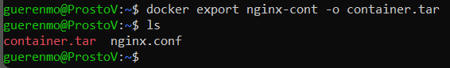
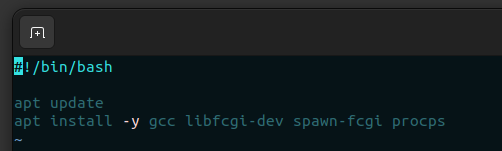
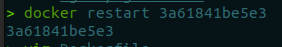
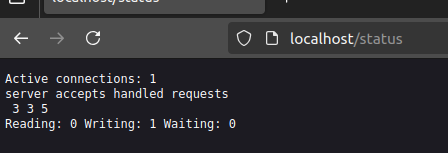
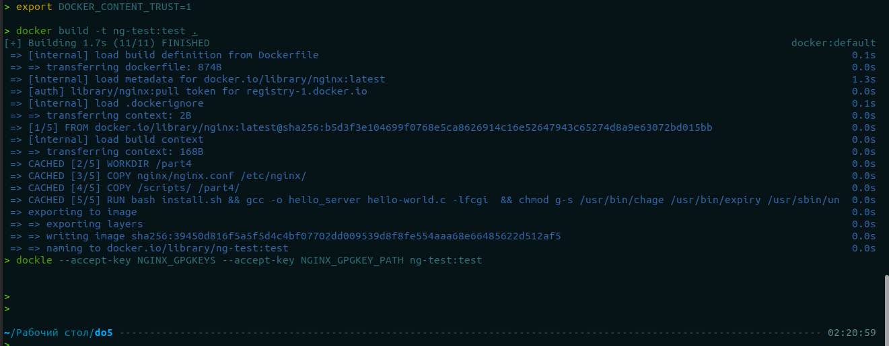

# Simple Docker

`// made by guerenmo // линукс с сетями одолели, одолеем и докер` 

Введение в докер. Разработка простого докер-образа для собственного сервера.

## Разделы
1. [Готовый докер](#part-1-готовый-докер) 
2. [Операции с контейнером](#part-2-операции-с-контейнером)  
3. [Мини веб-сервер](#part-3-мини-веб-сервер)   
4. [Свой докер](#part-4-свой-докер)  
5. [Dockle](#part-5-dockle)  
6. [Базовый Docker Compose](#part-6-базовый-docker-compose)

## Part 1. Готовый докер

* Взял официальный докер-образ с **nginx** из реестра Docker Hub с помощью команды `docker pull`.

    

* Проверил наличие докер-образа через `docker images`.

    

* Запустил докер-образ через `docker run -d nginx` (опция **-d** запускает контейнер в фоновом режиме и выводит его идентификатор).

    

* Проверил запуск образа через `docker ps` (по умолчанию функция выводит только запущенные контейнеры).

    

    * **CONTAINER ID** - уникальный идентификатор контейнера.
    * **IMAGE** - имя Docker-образа, на основе которого был создан контейнер.
    * **COMMAND** - команда, которая выполняется внутри контейнера.
    * **CREATED** - время, когда контейнер был создан.
    * **STATUS** — текущее состояние контейнера (например, "Up 27 seconds" означает, что контейнер запущен в течение 27 секунд).
    * **PORTS** — информация о портах, которые проброшены из контейнера наружу (в данном случае доступен 80 порт с протоколом tcp)
    * **NAMES** — имя контейнера, которое присвоено либо вручную через опцию `--name`, либо автоматически (контейнеру автоматически присвоено имя **relaxed_spence**).

* Вывел информацию о контейнере через `docker inspect -s relaxed_spence`.

    

* Из вывода команды нашел информацию:

    * о размере контейнера (опция **-s** выводит дополнительно информацию о размере контейнера);

        

        В поле *SizeRootFs* выведен размер всех файлов контейнера в байтах, включая файлы образа. В поле *SizeRW* выведен размер всех созданных и/или измененных файлов в дополнении к образу.

    * о списке замапленных портов;

        

    * об ip контейнера.

        

* Остановил контейнер через `docker stop relaxed_spence` и проверил, что он остановился через `docker ps`.

    

* Запустил новый контейнер с портами 80 и 443 через команду `docker run -p 80:80 -p 443:443 -d nginx`:

    

    * Опция `--name` задает имя контейнеру вручную (в данном случае контейнеру присвоено имя **nginx-cont**);

    * Опция `-p` позволяет пробросить порт контейнера на порт локальной машины. В данном случае порт 80 контейнера проброшен на порт 80 локальной машины, и, аналогично, порт 443 контейнера проброшен на порт 443 локальной машины;

    * Опция `-d` запускает контейнер в фоновом режиме.

* Проверил доступ к стартовой странице **nginx** по адресу *localhost:80*.

    

* Перезапустил контейнер через `docker restart nginx-cont` и проверил, что он запустился через `docker ps`.

    

    В поле `STATUS` можно увидеть, что контейнер был запущен в течение пяти секунд.

## Part 2. Операции с контейнером

* Через команду `docker exec nginx-cont cat /etc/nginx/nginx.conf` прочитал конфигурационный файл */etc/nginx/nginx.conf* внутри контейнера. Команда `docker exec` запускает команду внутри контейнера.

    

* Создал на локальной машине файл *nginx.conf* и поместил в него содержимое вышеуказанного файла.

    

    Результат команды:

    

* Настроил в нем по пути */status* отдачу страницы статуса сервера **nginx**:

    * Закомментировал строку *include /etc/nginx/conf.d/*.conf;* для избежания конфликтов при запуске нового сервера;

    * Прописал прослушивание 80 порта (**listen 80** работает для ipv4 адресов, **listen [::]:80** для ipv6);

    * Установил имя сервера *localhost*;

    * В блоке *location* прописал действие сервера при обращении к директиве *status* в запросе, в данном случае будет выдаваться страница статуса сервера.

    

* Скопировал созданный файл *nginx.conf* внутрь докер-образа через команду `docker cp`.

    

* Перезапустил **nginx** внутри контейнера через `exec`.

    

* Проверил, что по адресу **localhost:80/status** отдается страница со статусом сервера.

    

* Экспортировал контейнер *nginx-cont* с помощью команды `docker export`.

    

* Остановил контейнер через `docker stop`.

    

* Удалил образ через `docker rmi -f`.

    

    * Если перед удалением образа мы не удаляем контейнер, то необходимо использовать опцию `-f`, она выполняет принудительное удаление образа.

* Удалил контейнер через `docker rm`.

    

* После всех манипуляций проверил наличие образа и контейнера командами `docker ps -a` (показывает все контейнеры) и `docker images` (скрин выше)

* Импортировал контейнер **container.tar** обратно командой `docker import`:

    

    * При экспорте метаданные контейнера, например, инструкции **CMD** и **ENTRYPOINT**, не сохраняются. Поэтому при импорте нужно их указывать с помощью опции `-c` в команде `docker import` или при запуске контейнера через `docker run`;

    * При запуске контейнера с **nginx** обязательна для выполнения команда `nginx -g "daemon off;"`, которая позволяет **nginx** быть основным процессом. Это необходимое [условие](https://hub.docker.com/_/nginx#:~:text=If%20you%20add%20a%20custom%20CMD%20in%20the%20Dockerfile%2C%20be%20sure%20to%20include%20%2Dg%20daemon%20off%3B%20in%20the%20CMD%20in%20order%20for%20nginx%20to%20stay%20in%20the%20foreground%2C%20so%20that%20Docker%20can%20track%20the%20process%20properly%20(otherwise%20your%20container%20will%20stop%20immediately%20after%20starting)!) для запуска контейнера с nginx.

* Командой `docker images` проверил, что образ был успешно импортирован (скрин выше).

* Командой `docker inspect` проверил конфигурацию контейнера, настройки для **CMD** и **ENTRYPOINT** успешно сохранились при импорте.

    

* Запустил импортированный контейнер с маппингом портов 80 и 443.

    

* Проверил, что сервер корректно выдает страницу о его статусе при запросе `localhost:80/status`.

    

## Part 3. Мини веб-сервер

* Написал мини-сервер на **C** и **FastCGI**, который возвращает страницу с `Hello World!`:

    

    * **FastCGI** представляет собой улучшенной **CGI-программой**, обрабатывающая запросы в цикле, вместо того, чтобы заново запускаться для нового запроса. После обработки одного запроса программа ожидает следующий запрос. Цикл завершается при системном сбое или принудительном завершении процесса администратором;
    
    * В скрипте используется структура `req` типа `FCGX_Request` для хранения информации о запросе;

    * Функция `FCGX_InitRequest` инициализирует структуру запроса `req`. Первый аргумент - это указатель на объект запроса. Второй аргумент указывает на используемый сокет, в данном случае он указывает на стандартный поток (**STDIN**, **STDOUT**, **STDERR**). Третий параметр - это флаги, управляющие поведением FastCGI при инициализации запроса. Если в параметре указано значение 0, программа работает в стандартном режиме без особых условий обработки запроса;

    * Функция `FCGX_Accept_r` ожидает новый запрос от веб-сервера. Она заполняет структуру `req`. Если запрос был успешно обработан, то функция возвращает 0. После принятия запроса выполняются команды в теле цикла;

    * Функция `FCGX_FPrintF` отправляет ответ клиенту через **FastCGI**. В этом скрипте по потоку `req.out` отправляется ответ в виде html-страницы. Тело страницы состоит из заголовка `<h1>` с текстом **Hello, World!**;

    * Функция `FCGX_Finish_r` завершает обработку текущего запроса, освобождая ресурсы, которые были выделены для его обработки.

* Скомпилировал скрипт и запустил его через утилиту `spawn-fcgi`, в ней задал на каком сокете (порт и ip-адрес) сервер будет принимать запросы:

    

* Написал свой **nginx.conf**, которые проксирует запросы с **81** порта на **127.0.0.1:8080**:

    

* Перезапустил **nginx**

    

* Проверил, что корректно выдатается страница с текстом `Hello, World!` двумя способами:

    * Через браузер

        

    * Через утилиту curl

        

* Положил файл nginx.conf в *./nginx/nginx.conf* на локальной машине:

    

## Part 4. Свой докер

* Написал *Dockerfile*, который собирает собственный докер-образ:

    

    * `FROM` использует в качестве базового образа официальный образ *nginx*;

    * `WORKDIR` инициализирует рабочую папку *part4*, которая будет использоваться по умолчанию для инструкций `RUN`, `CMD`, `ENTRYPOINT`, `COPY` и `ADD`;

    * `ADD` копирует файл **nginx.conf** и папку со скриптами **scripts** в образ;

    * `RUN` запускает скрипт установки нужных библиотек и сборку файла сервера;

    * В `CMD` прописаны команды, которые будут запускаться при запуске контейнера. В данном случае при старте работы контейнера запускается сервер.

* В папке **scripts** хранятся два скрипта: скрипт сервера, который был описан в третьем задании, и скрипт установки библиотек. Исходный код скрипта:

    

* Командой `docker build` запустил сборку докер-образа и указал его имя и тег:

    

    * Точка указывает, что образ использует файлы для сборки в текущей директории;

    * Опция `-t` указывает имя и тег образу;

    * Опцией `-f` явно указываем какой докерфайл используем для сборки. 

* Через `docker images` проверил, что образ успешно собрался:

    

* Запустил собранный образ с маппингом 81 порта на 80 на локальной машине и маппингом файла **/nginx/nginx.conf**:

    

* Проверил, что по запросу **localhost:80** выдается страница с `Hello, World!`:

    

* Дописал в файле **nginx/nginx.conf** проксирование странички */status*, по которой будет выдаваться статус сервера **nginx**:

    

* Перезапустил контейнер:

    

* Проверил, что по адресу **localhost:80/status** выдается страница статуса сервера **nginx**:

    

## Part 5. Dockle

* Просканировал образ из предыдущего задания через `Dockle`:

    

    * **FATAL CIS-DI-0010: Do not store credential in environment variables/files** \
    Явная проблема: В контейнере есть подозрительные переменные среды.
    Для решения проблемы можно ввести `--ak NGINX_GPGKEY --ak NGINX_GPGKEY_PATH ` в команде `dockle` для того, чтобы использование переменных среды и ключей было подтверждено.

    * **WARN  CIS-DI-0001: Create a user for the container** \
    Проблема: В контейнере используется root-пользователь. Нужно создать отдельного пользователя и использовать его для запуска приложений в контейнере.

    * **INFO CCIS-DI-0005: Enable Content trust for Docker** \
    Рекомендация: Включить Docker Content Trust, установив DOCKER_CONTENT_TRUST=1 перед сборкой или загрузкой образа, чтобы удостовериться, что образы подписаны и проверены.

    * **INFO CIS-DI-0006: Add HEALTHCHECK instruction to the container image** \
    Рекомендация: Добавить инструкцию HEALTHCHECK в Dockerfile, чтобы Docker мог проверять состояние контейнера и автоматически перезапускать его в случае неполадок.

    * **INFO CIS-DI-0008: Confirm safety of setuid/setgid files** \
    Рекомендация: В образе есть файлы с установленными флагами setuid/setgid, которые могут быть потенциальной уязвимостью. Желательно убрать флаги setuid/setgid.

* Исправил *Dockerfile* так, чтобы устранить ошибки, выведенные при сканировании образа в `Dockle`:

    

* Пересобрал образ и вновь проверил через `Dockle` - ошибок нет:

    

## Part 6. Базовый Docker Compose

* Написал файл *docker-compose.yml*, который
    1) поднимает докер-контейнер из части 5, без маппинга портов;
    2) поднимает докер-контейнер с **nginx**, который будет проксировать запросы с 8080 порта на 81 порт первого контейнера;
    3) мапит 8080 порт второго контейнера на 80 порт локальной машины.

    

    * в блоке `services` описывается работа с сервисами aka контейнерами (1 сервис = 1 контейнер);

    * в блоке `build` сервиса **service_part5** описывается нюансы сборки контейнера, в данном случае обозначена папка сборки в `context` и имя конкретного докерфайла в `Dockerfile`;

    * в описании сервиса **service_nginx** указаны следующие настройки:

        * какой образ берется для сборки в `image`;

        * маппинг портов контейнера на локальную машину в `ports`;

        * зависимость от другого сервиса в `depends_on` - указывается к какому сервису привязан текущий сервис, он будет запускаться после запуска конкретного сервиса;

        * маппинг файла и папок в `volumes` - это нужно для изменения файла `nginx.conf` в сервисе.

* Остановлены все контейнеры:

    

* Запущена сборка проектов через `docker compose build`:

    

* Контейнеры запущены через `docker compose up`:

    

* Проверил через команду `curl localhost:80` выдачу страницы с текстом `Hello, World!`, который должен выдавать контейнер сервиса **service_part5**:

    

* Измененная часть файла *nginx.conf*, который был привязан к файлу `/etc/nginx/nginx.conf` в контейнере **service_nginx**

    

**фуууух...это было весело на самом деле**\
**только затупил жостко в part 3.........**\
**зато разобрался, чувствую себя этим котиком**\
